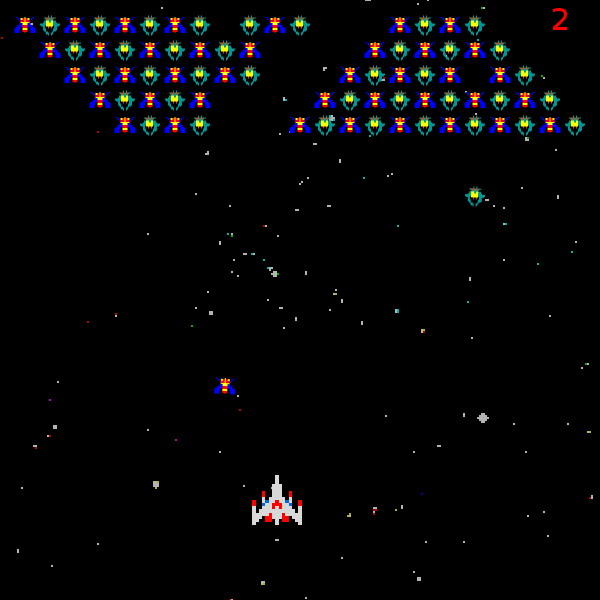
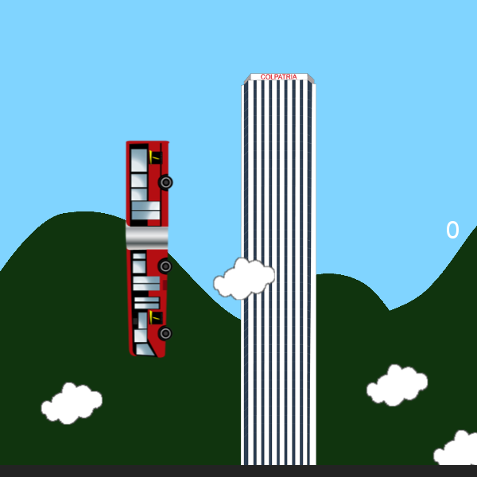
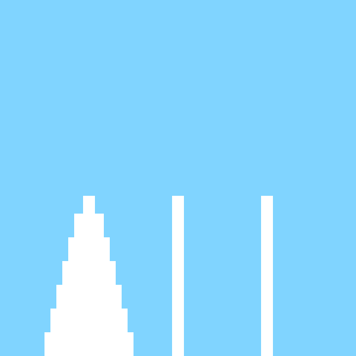
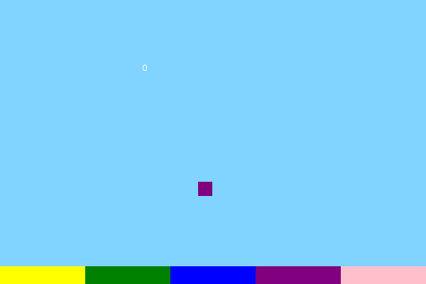
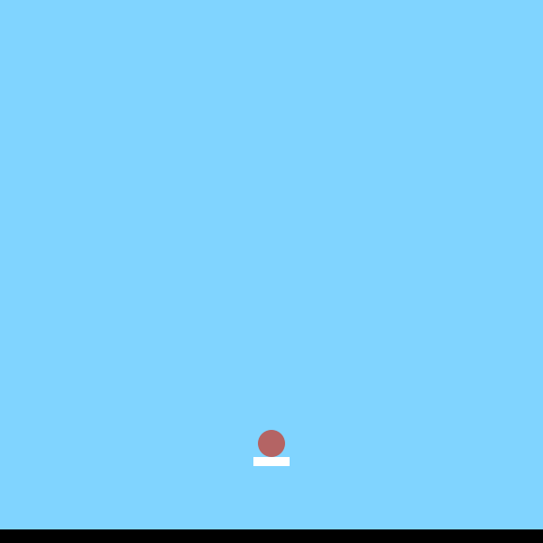

# FutureGame
##Javascript

A repository for the *Oriented Objects Programming* course of the [National University of Colombia](http://www.unal.edu.co/).

Powered by [Jimmy Pulido](https://github.com/jiapulidoar) - [Sebstian Chaves] (https://github.com/adamantwharf) - [Laura Santos](https://github.com/lsfinite). 

Or proyect consisted of a series of minigames. The player select wich one of them want to play. 
They are easy to play ( and lose ) for more entertaiment. 
The games _DOESN'T_ run correctly on  GOOGLE CHROME, so we define the prefered browsers as: Only Mozilla Firefox .

Presentation Available: [Here](http://futureun.github.io/PresentationFutureGame/)

Now Avalaible for Web: [Here](http://futureun.github.io/FutureGame/) :)

## Instalation 

    
    $ git clone https://github.com/FutureUN/FutureGame.git
    $ cd FutureGame
    

For the game we used the P5 js libraries. Used for the creation of games and plaything. 
More information: (http://p5js.org/)

The instruction for each game will be in the comments at the begging of the code.

The mini games are:

 
- "Galaga"

 </img>

- Trasmi-Clouds
 
 </img>

- Sticks

 </img>

- Color drop

</img>
 
- Bounce 

</img>

Enjoy playing. 

Thanks. "

